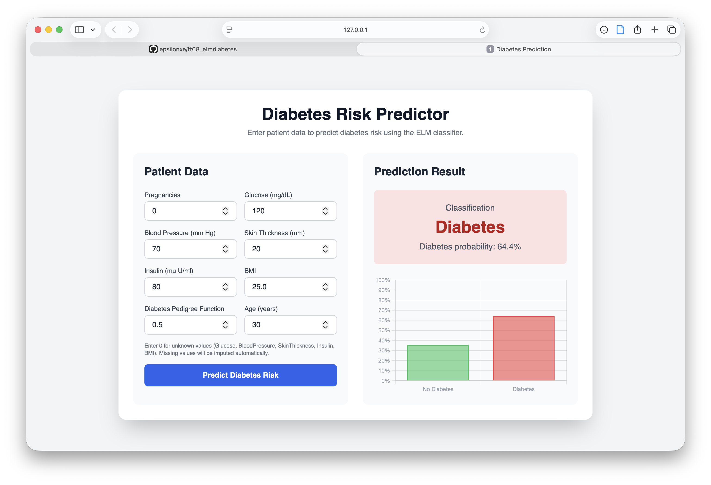

# Diabetes Risk Predictor

A Django web application for predicting diabetes risk using an Extreme Learning Machine (ELM) classifier trained on the Pima Indians Diabetes Dataset.



## Features

- Real-time diabetes risk prediction via web interface
- ELM classifier with L2 regularization
- 8 input features for patient data
- Probability visualization with Chart.js
- Responsive UI with Tailwind CSS
- Automatic handling of missing values (zeros are imputed)

## Model Performance

| Metric | Value |
|--------|-------|
| Accuracy | 68.10% |
| AUC-ROC | 0.754 |
| Precision | 52.83% |
| Recall | 70.00% |
| F1-Score | 0.602 |

**Model Configuration:**
- Hidden Neurons: 1000
- Activation: ReLU
- L2 Regularization: 0.01
- Decision Threshold: 0.57

## Installation

1. Clone the repository:
```bash
git clone https://github.com/epsilonxe/ff68_elmdiabetes.git diabetes-predictor
cd diabetes-predictor
```

2. Create and activate a virtual environment:
```bash
python -m venv venv
source venv/bin/activate  # On Windows: venv\Scripts\activate
```

3. Install dependencies:
```bash
pip install -r requirements.txt
```

4. Apply database migrations:
```bash
python manage.py migrate
```

5. Run the development server:
```bash
python manage.py runserver
```

6. Access the application at `http://localhost:8000/`

## Usage

### Web Interface

1. Navigate to `http://localhost:8000/`
2. Enter patient data in the form:
   - Pregnancies
   - Glucose (mg/dL)
   - Blood Pressure (mm Hg)
   - Skin Thickness (mm)
   - Insulin (mu U/ml)
   - BMI
   - Diabetes Pedigree Function
   - Age (years)
3. Click "Predict Diabetes Risk"
4. View the prediction result and probability chart

**Note:** Enter 0 for unknown values in Glucose, BloodPressure, SkinThickness, Insulin, or BMI. These will be automatically imputed using training set medians.

### API Endpoint

**POST /predict/**

Request body (JSON):
```json
{
    "pregnancies": 6,
    "glucose": 148,
    "bloodPressure": 72,
    "skinThickness": 35,
    "insulin": 0,
    "bmi": 33.6,
    "dpf": 0.627,
    "age": 50
}
```

Response:
```json
{
    "prediction": 1,
    "classification": "Diabetes",
    "probability_diabetes": 0.7234,
    "probability_no_diabetes": 0.2766
}
```

## Input Features

| Feature | Description | Unit | Missing Value |
|---------|-------------|------|---------------|
| Pregnancies | Number of pregnancies | count | N/A |
| Glucose | Plasma glucose concentration | mg/dL | 0 |
| BloodPressure | Diastolic blood pressure | mm Hg | 0 |
| SkinThickness | Triceps skin fold thickness | mm | 0 |
| Insulin | 2-Hour serum insulin | mu U/ml | 0 |
| BMI | Body mass index | kg/m² | 0 |
| DiabetesPedigreeFunction | Diabetes pedigree function | - | N/A |
| Age | Age in years | years | N/A |

## Project Structure

```
.
├── manage.py               # Django management script
├── requirements.txt        # Python dependencies
├── README.md              # This file
├── myproject/             # Django project configuration
│   ├── settings.py
│   ├── urls.py
│   ├── wsgi.py
│   └── asgi.py
├── ml_app/                # Django app for predictions
│   ├── views.py           # API endpoints
│   ├── urls.py            # URL routing
│   └── ...
├── templates/
│   └── index.html         # Web interface
└── playground/
    └── production/
        ├── elm_production.py           # ELM and predictor classes
        └── elm_production_model.pkl    # Trained model artifact
```

## Technical Details

### Preprocessing Pipeline

1. **Missing Value Handling**: Zeros in medical columns (Glucose, BloodPressure, SkinThickness, Insulin, BMI) are replaced with NaN and imputed using training set medians
2. **Feature Scaling**: StandardScaler normalization
3. **Dimensionality Reduction**: PCA (retains 95% variance)
4. **Classification**: ELM with optimized decision threshold (0.57)

### Model Architecture

The Extreme Learning Machine (ELM) is a single-hidden-layer feedforward neural network where:
- Input weights and biases are randomly initialized
- Output weights are computed analytically using Moore-Penrose pseudoinverse
- L2 regularization prevents overfitting

## Dataset

The model was trained on the [Pima Indians Diabetes Dataset](https://www.kaggle.com/datasets/uciml/pima-indians-diabetes-database) from the National Institute of Diabetes and Digestive and Kidney Diseases.

- **Records**: 768
- **Population**: Females aged 21+ of Pima Indian heritage
- **Target**: Binary classification (0 = No Diabetes, 1 = Diabetes)

## Production Model Usage

You can load and use the trained ELM model directly from Python:

```python
import pickle
import numpy as np

# Load the production model (run from the public/ directory)
with open('ml_app/elm_production_model.pkl', 'rb') as f:
    artifact = pickle.load(f)

predictor = artifact['predictor']

# Input: numpy array with 8 features
# [Pregnancies, Glucose, BloodPressure, SkinThickness, Insulin, BMI, DPF, Age]
patient = np.array([[6, 148, 72, 35, 0, 33.6, 0.627, 50]])

prediction = predictor.predict(patient)        # Returns 0 or 1
probability = predictor.predict_proba(patient)  # Returns 0.0 to 1.0
```

## License

This project is for educational and research purposes.

## Acknowledgments

- Pima Indians Diabetes Dataset (NIDDK via Kaggle)
- Django Framework
- Tailwind CSS
- Chart.js
